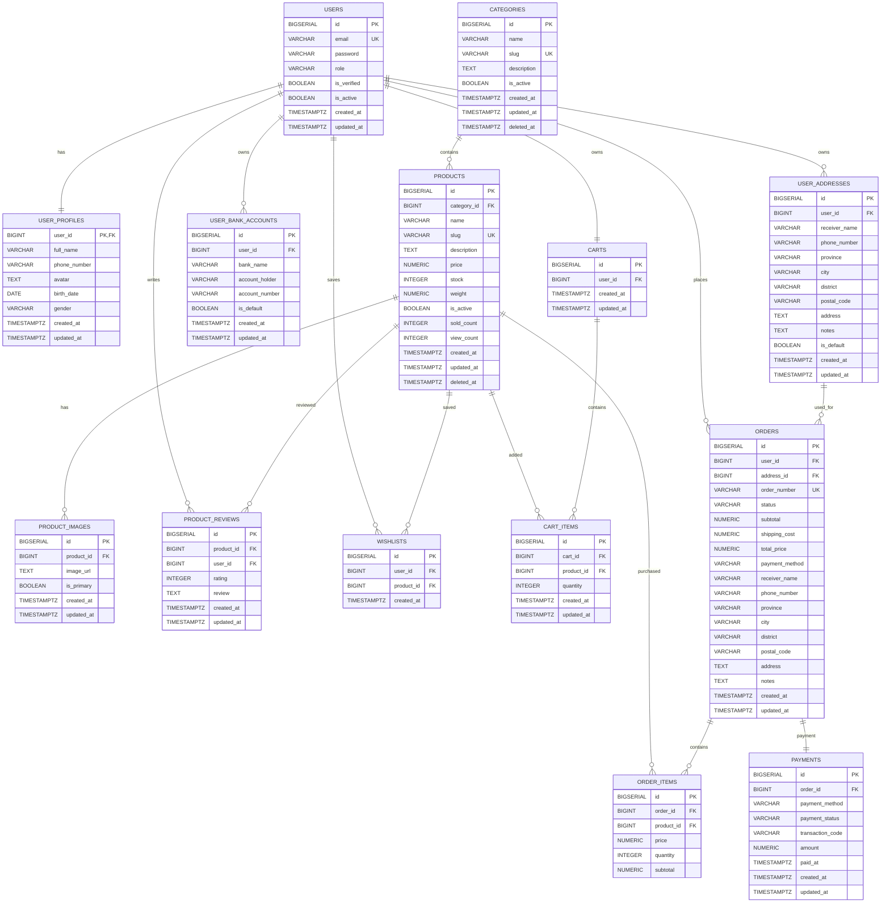

# Entity Relationship Diagram

```mermaid
erDiagram

    USERS {
        BIGSERIAL id PK
        VARCHAR email UK
        VARCHAR password
        VARCHAR role
        BOOLEAN is_verified
        BOOLEAN is_active
        TIMESTAMPTZ created_at
        TIMESTAMPTZ updated_at
    }

    USER_PROFILES {
        BIGINT user_id PK,FK
        VARCHAR full_name
        VARCHAR phone_number
        TEXT avatar
        DATE birth_date
        VARCHAR gender
        TIMESTAMPTZ created_at
        TIMESTAMPTZ updated_at
    }

    USER_ADDRESSES {
        BIGSERIAL id PK
        BIGINT user_id FK
        VARCHAR receiver_name
        VARCHAR phone_number
        VARCHAR province
        VARCHAR city
        VARCHAR district
        VARCHAR postal_code
        TEXT address
        TEXT notes
        BOOLEAN is_default
        TIMESTAMPTZ created_at
        TIMESTAMPTZ updated_at
    }

    USER_BANK_ACCOUNTS {
        BIGSERIAL id PK
        BIGINT user_id FK
        VARCHAR bank_name
        VARCHAR account_holder
        VARCHAR account_number
        BOOLEAN is_default
        TIMESTAMPTZ created_at
        TIMESTAMPTZ updated_at
    }

    CATEGORIES {
        BIGSERIAL id PK
        VARCHAR name
        VARCHAR slug UK
        TEXT description
        BOOLEAN is_active
        TIMESTAMPTZ created_at
        TIMESTAMPTZ updated_at
        TIMESTAMPTZ deleted_at
    }

    PRODUCTS {
        BIGSERIAL id PK
        BIGINT category_id FK
        VARCHAR name
        VARCHAR slug UK
        TEXT description
        NUMERIC price
        INTEGER stock
        NUMERIC weight
        BOOLEAN is_active
        INTEGER sold_count
        INTEGER view_count
        TIMESTAMPTZ created_at
        TIMESTAMPTZ updated_at
        TIMESTAMPTZ deleted_at
    }

    PRODUCT_IMAGES {
        BIGSERIAL id PK
        BIGINT product_id FK
        TEXT image_url
        BOOLEAN is_primary
        TIMESTAMPTZ created_at
        TIMESTAMPTZ updated_at
    }

    PRODUCT_REVIEWS {
        BIGSERIAL id PK
        BIGINT product_id FK
        BIGINT user_id FK
        INTEGER rating
        TEXT review
        TIMESTAMPTZ created_at
        TIMESTAMPTZ updated_at
    }

    WISHLISTS {
        BIGSERIAL id PK
        BIGINT user_id FK
        BIGINT product_id FK
        TIMESTAMPTZ created_at
    }

    CARTS {
        BIGSERIAL id PK
        BIGINT user_id FK
        TIMESTAMPTZ created_at
        TIMESTAMPTZ updated_at
    }

    CART_ITEMS {
        BIGSERIAL id PK
        BIGINT cart_id FK
        BIGINT product_id FK
        INTEGER quantity
        TIMESTAMPTZ created_at
        TIMESTAMPTZ updated_at
    }

    ORDERS {
        BIGSERIAL id PK
        BIGINT user_id FK
        BIGINT address_id FK

        VARCHAR order_number UK

        VARCHAR status

        NUMERIC subtotal
        NUMERIC shipping_cost
        NUMERIC total_price

        VARCHAR payment_method

        VARCHAR receiver_name
        VARCHAR phone_number

        VARCHAR province
        VARCHAR city
        VARCHAR district
        VARCHAR postal_code

        TEXT address
        TEXT notes

        TIMESTAMPTZ created_at
        TIMESTAMPTZ updated_at
    }

    ORDER_ITEMS {
        BIGSERIAL id PK
        BIGINT order_id FK
        BIGINT product_id FK
        NUMERIC price
        INTEGER quantity
        NUMERIC subtotal
    }

    PAYMENTS {
        BIGSERIAL id PK
        BIGINT order_id FK
        VARCHAR payment_method
        VARCHAR payment_status
        VARCHAR transaction_code
        NUMERIC amount
        TIMESTAMPTZ paid_at
        TIMESTAMPTZ created_at
        TIMESTAMPTZ updated_at
    }

    USERS ||--|| USER_PROFILES : has

    USERS ||--o{ USER_ADDRESSES : owns

    USERS ||--o{ USER_BANK_ACCOUNTS : owns

    USERS ||--|| CARTS : owns

    USERS ||--o{ ORDERS : places

    USERS ||--o{ PRODUCT_REVIEWS : writes

    USERS ||--o{ WISHLISTS : saves

    CATEGORIES ||--o{ PRODUCTS : contains

    PRODUCTS ||--o{ PRODUCT_IMAGES : has

    PRODUCTS ||--o{ PRODUCT_REVIEWS : reviewed

    PRODUCTS ||--o{ CART_ITEMS : added

    PRODUCTS ||--o{ ORDER_ITEMS : purchased

    PRODUCTS ||--o{ WISHLISTS : saved

    CARTS ||--o{ CART_ITEMS : contains

    USER_ADDRESSES ||--o{ ORDERS : used_for

    ORDERS ||--o{ ORDER_ITEMS : contains

    ORDERS ||--|| PAYMENTS : payment
```
