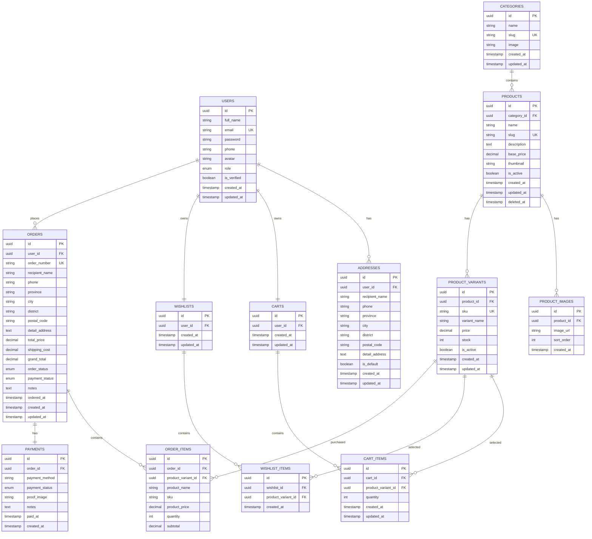

# Entity Relationship Diagram

```mermaid
erDiagram

USERS {
    uuid id PK
    string full_name
    string email UK
    string password
    string phone
    string avatar
    enum role
    boolean is_verified
    timestamp created_at
    timestamp updated_at
}

USERS ||--o{ ADDRESSES : has
ADDRESSES {
    uuid id PK
    uuid user_id FK
    string recipient_name
    string phone
    string province
    string city
    string district
    string postal_code
    text detail_address
    boolean is_default
    timestamp created_at
    timestamp updated_at
}
USERS ||--|| CARTS : owns
CARTS {
    uuid id PK
    uuid user_id FK
    timestamp created_at
    timestamp updated_at
}
USERS ||--|| WISHLISTS : owns
USERS ||--o{ ORDERS : places

CATEGORIES ||--o{ PRODUCTS : contains
CATEGORIES {
    uuid id PK
    string name
    string slug UK
    string image
    timestamp created_at
    timestamp updated_at
}

PRODUCTS ||--o{ PRODUCT_IMAGES : has
PRODUCT_IMAGES {
    uuid id PK
    uuid product_id FK
    string image_url
    int sort_order
    timestamp created_at
}
PRODUCTS ||--o{ PRODUCT_VARIANTS : has
PRODUCTS {
    uuid id PK
    uuid category_id FK
    string name
    string slug UK
    text description
    decimal base_price
    string thumbnail
    boolean is_active
    timestamp created_at
    timestamp updated_at
    timestamp deleted_at
}

CARTS ||--o{ CART_ITEMS : contains
CART_ITEMS {
    uuid id PK
    uuid cart_id FK
    uuid product_variant_id FK
    int quantity
    timestamp created_at
    timestamp updated_at
}

WISHLISTS ||--o{ WISHLIST_ITEMS : contains
WISHLISTS {
    uuid id PK
    uuid user_id FK
    timestamp created_at
    timestamp updated_at
}

ORDERS ||--o{ ORDER_ITEMS : contains
ORDER_ITEMS {
    uuid id PK
    uuid order_id FK
    uuid product_variant_id FK

    string product_name
    string sku

    decimal product_price

    int quantity

    decimal subtotal
}
ORDERS ||--|| PAYMENTS : has
PAYMENTS {
    uuid id PK
    uuid order_id FK

    string payment_method

    enum payment_status

    string proof_image

    text notes

    timestamp paid_at
    timestamp created_at
}
ORDERS {
    uuid id PK
    uuid user_id FK
    string order_number UK

    string recipient_name
    string phone

    string province
    string city
    string district
    string postal_code
    text detail_address

    decimal total_price
    decimal shipping_cost
    decimal grand_total

    enum order_status
    enum payment_status

    text notes

    timestamp ordered_at
    timestamp created_at
    timestamp updated_at
}

PRODUCT_VARIANTS ||--o{ CART_ITEMS : selected
PRODUCT_VARIANTS ||--o{ WISHLIST_ITEMS : selected
WISHLIST_ITEMS {
    uuid id PK
    uuid wishlist_id FK
    uuid product_variant_id FK
    timestamp created_at
}
PRODUCT_VARIANTS ||--o{ ORDER_ITEMS : purchased
PRODUCT_VARIANTS {
    uuid id PK
    uuid product_id FK
    string sku UK
    string variant_name
    decimal price
    int stock
    boolean is_active
    timestamp created_at
    timestamp updated_at
}
```